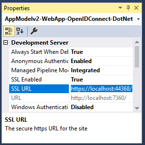

# Create your ASP.NET project

1. In Visual Studio: File > New > Project
2. Under Visual C#\Web, select ASP.NET Web Application (.NET Framework).
3. Name your application and click OK
4. Select Empty and select the checkbox to add MVC references


# Add authentication components

1. In Visual Studio: Tools > Nuget Package Manager > Package Manager Console
2. Add OWIN middleware NuGet packages by typing the following in the Package Manager Console window:

``` powershell
Install-Package Microsoft.Owin.Security.OpenIdConnect
Install-Package Microsoft.Owin.Security.Cookies
Install-Package Microsoft.Owin.Host.SystemWeb
```

# Configure the authentication pipeline

The steps below are used to create an OWIN middleware Startup Class to configure OpenID Connect authentication. This class will be executed automatically when your IIS process starts.

If your project doesn't have a Startup.cs file in the root folder:

1. Right click on the project's root folder: > Add > New Item... > OWIN Startup class
2. Name it Startup.cs

Make sure the class selected is an OWIN Startup Class and not a standard C# class. Confirm this by checking if you see [assembly: OwinStartup(typeof({NameSpace}.Startup))] above the namespace.

1. Add OWIN and Microsoft.IdentityModel references to Startup.cs:

``` c#
using Microsoft.Owin;
using Owin;
using Microsoft.IdentityModel.Protocols;
using Microsoft.Owin.Security;
using Microsoft.Owin.Security.Cookies;
using Microsoft.Owin.Security.OpenIdConnect;
using Microsoft.Owin.Security.Notifications;
```

2. Replace Startup class with the code below: 

``` c#
public class Startup
{        
    // The Client ID is used by the application to uniquely identify itself to Azure AD.
    string clientId = System.Configuration.ConfigurationManager.AppSettings["ClientId"];

    // RedirectUri is the URL where the user will be redirected to after they sign in.
    string redirectUri = System.Configuration.ConfigurationManager.AppSettings["RedirectUri"];

    // Tenant is the tenant ID (e.g. contoso.onmicrosoft.com, or 'common' for multi-tenant)
    static string tenant = System.Configuration.ConfigurationManager.AppSettings["Tenant"];

    // Authority is the URL for authority, composed by Azure Active Directory v2 endpoint and the tenant name (e.g. https://login.microsoftonline.com/contoso.onmicrosoft.com/v2.0)
    string authority = String.Format(System.Globalization.CultureInfo.InvariantCulture, System.Configuration.ConfigurationManager.AppSettings["Authority"], tenant);

    /// <summary>
    /// Configure OWIN to use OpenIdConnect 
    /// </summary>
    /// <param name="app"></param>
    public void Configuration(IAppBuilder app)
    {
        app.SetDefaultSignInAsAuthenticationType(CookieAuthenticationDefaults.AuthenticationType);

        app.UseCookieAuthentication(new CookieAuthenticationOptions());
            app.UseOpenIdConnectAuthentication(
            new OpenIdConnectAuthenticationOptions
            {
                // Sets the ClientId, authority, RedirectUri as obtained from web.config
                ClientId = clientId,
                Authority = authority,
                RedirectUri = redirectUri,
                // PostLogoutRedirectUri is the page that users will be redirected to after sign-out. In this case, it is using the home page
                PostLogoutRedirectUri = redirectUri,
                Scope = OpenIdConnectScopes.OpenIdProfile,
                // ResponseType is set to request the id_token - which contains basic information about the signed-in user
                ResponseType = OpenIdConnectResponseTypes.IdToken,
                // ValidateIssuer set to false to allow personal and work accounts from any organization to sign in to your application
                // To only allow users from a single organizations, set ValidateIssuer to true and 'tenant' setting in web.config to the tenant name
                // To allow users from only a list of specific organizations, set ValidateIssuer to true and use ValidIssuers parameter 
                TokenValidationParameters = new System.IdentityModel.Tokens.TokenValidationParameters() { ValidateIssuer = false },
                // OpenIdConnectAuthenticationNotifications configures OWIN to send notification of failed authentications to OnAuthenticationFailed method
                Notifications = new OpenIdConnectAuthenticationNotifications
                {
                    AuthenticationFailed = OnAuthenticationFailed
                }
            }
        );
    }

    /// <summary>
    /// Handle failed authentication requests by redirecting the user to the home page with an error in the query string
    /// </summary>
    /// <param name="context"></param>
    /// <returns></returns>
    private Task OnAuthenticationFailed(AuthenticationFailedNotification<OpenIdConnectMessage, OpenIdConnectAuthenticationOptions> context)
    {
        context.HandleResponse();
        context.Response.Redirect("/?errormessage=" + context.Exception.Message);
        return Task.FromResult(0);
    }
}
```

# Add a controller to handle sign-in and sign-out requests

This step shows how to create a new controller to expose sign-in and sign-out methods.

1. Right click the Controllers folder and select Add > Controller
2. Select MVC (.NET version) Controller – Empty.
3. Click Add
4. Name it HomeController and click Add
5. Add OWIN references to the class:


```c#
using Microsoft.Owin.Security;
using Microsoft.Owin.Security.Cookies;
using Microsoft.Owin.Security.OpenIdConnect;
```

6. Add the two methods below to handle sign-in and sign-out to your controller by initiating an authentication challenge via code: 

```c# 
/// <summary>
/// Send an OpenID Connect sign-in request.
/// Alternatively, you can just decorate the SignIn method with the [Authorize] attribute
/// </summary>
public void SignIn()
{
    if (!Request.IsAuthenticated)
    {
        HttpContext.GetOwinContext().Authentication.Challenge(
            new AuthenticationProperties{ RedirectUri = "/" },
            OpenIdConnectAuthenticationDefaults.AuthenticationType);
    }
}

/// <summary>
/// Send an OpenID Connect sign-out request.
/// </summary>
public void SignOut()
{
    HttpContext.GetOwinContext().Authentication.SignOut(
            OpenIdConnectAuthenticationDefaults.AuthenticationType,
            CookieAuthenticationDefaults.AuthenticationType);
}
```

# Create the app's home page to sign in users via a sign-in button

In Visual Studio, create a new view to add the sign-in button and display user information after authentication:

1. Right click the Views\Home folder and select Add View
2. Name it Index.
3. Add the following HTML, which includes the sign-in button, to the file:

```html
<html>
<head>
    <meta name="viewport" content="width=device-width" />
    <title>Sign-In with Microsoft Guide</title>
</head>
<body>
@if (!Request.IsAuthenticated)
{
    <!-- If the user is not authenticated, display the sign-in button -->
    <a href="@Url.Action("SignIn", "Home")" style="text-decoration: none;">
        <svg xmlns="http://www.w3.org/2000/svg" xml:space="preserve" width="300px" height="50px" viewBox="0 0 3278 522" class="SignInButton">
        <style type="text/css">.fil0:hover {fill: #4B4B4B;} .fnt0 {font-size: 260px;font-family: 'Segoe UI Semibold', 'Segoe UI'; text-decoration: none;}</style>
        <rect class="fil0" x="2" y="2" width="3174" height="517" fill="black" />
        <rect x="150" y="129" width="122" height="122" fill="#F35325" />
        <rect x="284" y="129" width="122" height="122" fill="#81BC06" />
        <rect x="150" y="263" width="122" height="122" fill="#05A6F0" />
        <rect x="284" y="263" width="122" height="122" fill="#FFBA08" />
        <text x="470" y="357" fill="white" class="fnt0">Sign in with Microsoft</text>
        </svg>
    </a>
}
else
{
    <span><br/>Hello @System.Security.Claims.ClaimsPrincipal.Current.FindFirst("name").Value;</span>
    <br /><br />
    @Html.ActionLink("See Your Claims", "Index", "Claims")
    <br /><br />
    @Html.ActionLink("Sign out", "SignOut", "Home")
}
@if (!string.IsNullOrWhiteSpace(Request.QueryString["errormessage"]))
{
    <div style="background-color:red;color:white;font-weight: bold;">Error: @Request.QueryString["errormessage"]</div>
}
</body>
</html>
```

# Add a controller to display user's claims

This controller demonstrates the uses of the [Authorize] attribute to protect a controller. This attribute restricts access to the controller by only allowing authenticated users. The code below makes use of the attribute to display user claims that were retrieved as part of the sign-in.

1. Right click the Controllers folder: Add > Controller
2. Select MVC {version} Controller – Empty.
3. Click Add
4. Name it ClaimsController
5. Replace the code of your controller class with the code below - this adds the [Authorize] attribute to the class:

```c#
[Authorize]
public class ClaimsController : Controller
{
    /// <summary>
    /// Add user's claims to viewbag
    /// </summary>
    /// <returns></returns>
    public ActionResult Index()
    {
        var claimsPrincipalCurrent = System.Security.Claims.ClaimsPrincipal.Current;
        //You get the user’s first and last name below:
        ViewBag.Name = claimsPrincipalCurrent.FindFirst("name").Value;

        // The 'preferred_username' claim can be used for showing the username
        ViewBag.Username = claimsPrincipalCurrent.FindFirst("preferred_username").Value;

        // The subject claim can be used to uniquely identify the user across the web
        ViewBag.Subject = claimsPrincipalCurrent.FindFirst(System.Security.Claims.ClaimTypes.NameIdentifier).Value;

        // TenantId is the unique Tenant Id - which represents an organization in Azure AD
        ViewBag.TenantId = claimsPrincipalCurrent.FindFirst("http://schemas.microsoft.com/identity/claims/tenantid").Value;

        return View();
    }
}
```

# Create a view to display the user's claims

In Visual Studio, create a new view to display the user's claims in a web page:

1. Right click the Views\Claims folder and: Add View
2. Name it Index.
3. Add the following HTML to the file:

```html
<html>
<head>
    <meta name="viewport" content="width=device-width" />
    <title>Sign-In with Microsoft Sample</title>
    <link href="@Url.Content("~/Content/bootstrap.min.css")" rel="stylesheet" type="text/css" />
</head>
<body style="padding:50px">
    <h3>Main Claims:</h3>
    <table class="table table-striped table-bordered table-hover">
        <tr><td>Name</td><td>@ViewBag.Name</td></tr>
        <tr><td>Username</td><td>@ViewBag.Username</td></tr>
        <tr><td>Subject</td><td>@ViewBag.Subject</td></tr>
        <tr><td>TenantId</td><td>@ViewBag.TenantId</td></tr>
    </table>
    <br />
    <h3>All Claims:</h3>
    <table class="table table-striped table-bordered table-hover table-condensed">
    @foreach (var claim in System.Security.Claims.ClaimsPrincipal.Current.Claims)
    {
        <tr><td>@claim.Type</td><td>@claim.Value</td></tr>
    }
</table>
    <br />
    <br />
    @Html.ActionLink("Sign out", "SignOut", "Home", null, new { @class = "btn btn-primary" })
</body>
</html>
```
# Configure your ASP.NET Web App with the application's registration information

In this step, you will configure your project to use SSL, and then use the SSL URL to configure your application’s registration information. After this, add the application’ registration information to your solution via web.config.

1. In Solution Explorer, select the project and look at the Properties window (if you don’t see a Properties window, press F4)
2. Change SSL Enabled to True
3. Copy the value from SSL URL above and paste it in the Redirect URL field on the top of this page, then click Update:



4. Add the following in web.config file located in root’s folder, under section configuration\appSettings:

```xml
<add key="ClientId" value="" />
<add key="RedirectUri" value="http://localhost" />
<add key="Tenant" value="common" />
<add key="Authority" value="https://login.microsoftonline.com/{0}/v2.0" />
```
# Test access to a method that has an Authorize attribute (optional)

To test access to the Authorize controller for the user's claims as an anonymous user, follow these steps:

1. Select the link to sign out the user and complete the sign-out process.
2. In your browser, type http://localhost:{port}/authenticated to access your controller that is protected with the Authorize attribute.

# Additional information

To protect your entire website, in the Global.asax file, add the AuthorizeAttribute attribute to the GlobalFilters filter in the Application_Start method:

```c#
GlobalFilters.Filters.Add(new AuthorizeAttribute());
```

## Restrict sign-in access to your application

By default, personal accounts like outlook.com, live.com, and others can sign in to your application. Work or school accounts in organizations that are integrated with Azure AD can also sign in by default.

To restrict user sign-in access for your application, several options are available.
Restrict access to a single organization

You can restrict sign-in access for your application to only user accounts that are in a single Azure AD organization:

1. In the web.config file, change the value for the Tenant parameter. Change the value from Common to the tenant name of the organization, such as contoso.onmicrosoft.com.
2. In your OWIN Startup class, set the ValidateIssuer argument to true.

## Restrict access to a list of organizations

You can restrict sign-in access to only user accounts that are in an Azure AD organization that is in the list of allowed organizations:

1. In the web.config file, in your OWIN Startup class, set the ValidateIssuer argument to true.
2. Set the value of the ValidIssuers parameter to the list of allowed organizations.

## Use a custom method to validate issuers

You can implement a custom method to validate issuers by using the IssuerValidator parameter. For more information about how to use this parameter, read about the TokenValidationParameters class on MSDN.